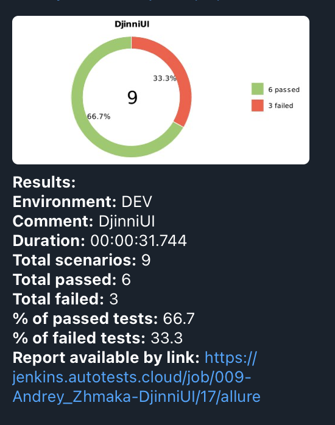
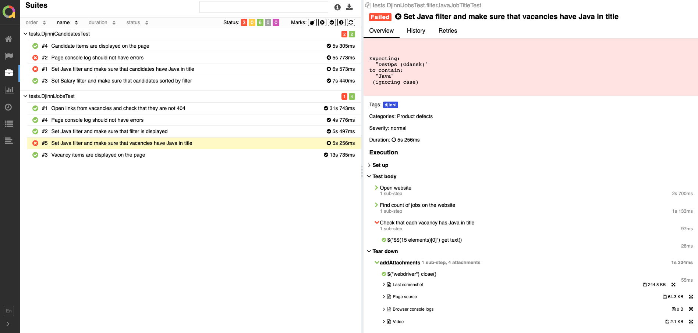
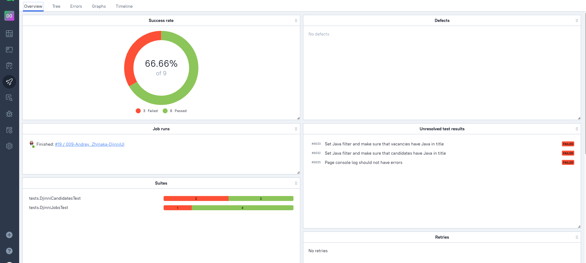
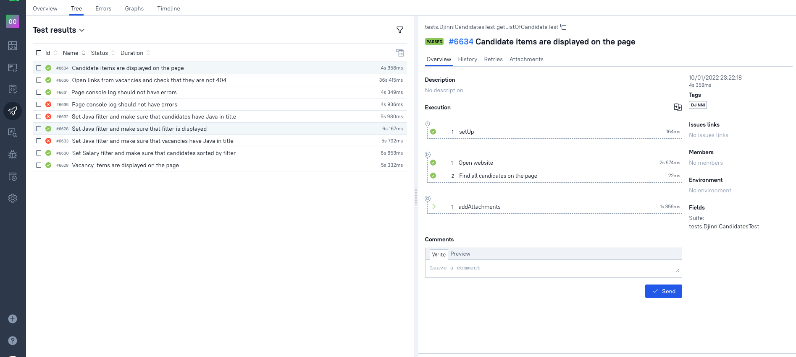
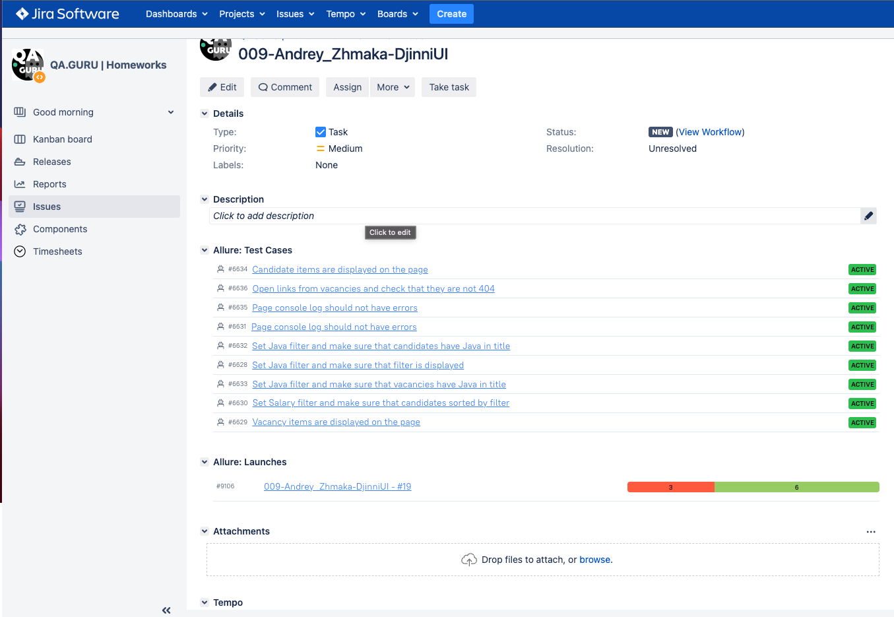

# Автотесты для сайта https://djinni.co/

___

## Используемые технологии и инструменты

<code></code>
<code></code>
<code></code>
<code></code>
<code></code>
<code></code>
<code></code>
<code></code>
 <code></code>
 
</p>

___

## Инструкция по запуску тестов

Запуск тестов происходит через джобу в [Jenkins](https://jenkins.autotests.cloud/job/009-Andrey_Zhmaka-DjinniUI/)
или через консоль

```bash
gradle clean test -DremoteDriverUrl=http://65.108.161.82:4444/wd/hub/ -DvideoStorage=http://65.108.161.82:8080/video/ -Dthreads=5
```

### Используемые параметры по умолчанию

* browser (chrome)
* browserSize (1920x1080)
* baseUrl (https://djinni.co/)

### Serve report:

```bash
allure serve build/allure-results
```

## Оповещение о результатах прохождения тестов через бот в телеграмм



## Анализ результатов

* Jenkins через Allure Reports или Allure TestOps

### Анализ результатов в Jenkins через Allure Reports



### Анализ результатов в Allure TestOps




### Интерграция с Jira
#### Отображение тест-кейсов и ланча



### Видео с примером прохождения теста в selenoid


